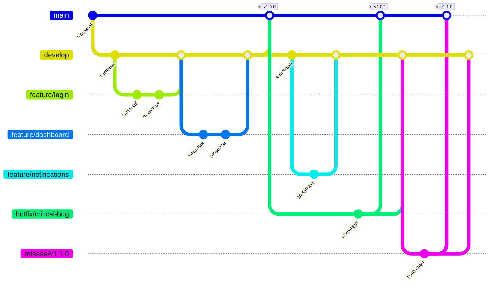

# Nuxt Boilerplate

A modern, feature-rich Nuxt.js boilerplate with TypeScript, Vue Query, Form Validation, and Internationalization support designed for building scalable web applications.


## 🚀 Features

- **Modern Stack**: Built with Nuxt 3, Vue 3, and TypeScript
- **Data Management**: Integrated TanStack Vue Query for efficient data fetching and caching
- **Form Handling**: Robust form validation with VeeValidate
- **Internationalization**: Multi-language support with Nuxt i18n
- **Styling**: TailwindCSS for utility-first styling with SASS support
- **Developer Experience**: ESLint, Prettier, Husky, and Conventional Commits
- **Type Safety**: Full TypeScript support throughout the codebase
- **Optimized Performance**: Built-in optimizations for production builds

## 📚 Tech Stack

### Core Dependencies

- [Nuxt 3](https://nuxt.com/) - The Intuitive Vue Framework (v3.14.x)
- [Vue 3](https://vuejs.org/) - Progressive JavaScript Framework
- [TypeScript](https://www.typescriptlang.org/) - JavaScript with syntax for types (v5.7.x)
- [Vue Router](https://router.vuejs.org/) - Official router for Vue.js

### Data Management & Forms

- [@tanstack/vue-query](https://tanstack.com/query/latest) - Powerful data synchronization for Vue (v5.62.x)
- [@vee-validate/nuxt](https://vee-validate.logaretm.com/v4/) - Form validation made easy (v4.15.x)
- [Yup](https://github.com/jquense/yup) - Schema validator for runtime value parsing and validation
- [Axios](https://axios-http.com/) - Promise based HTTP client (v1.7.x)
- [js-cookie](https://github.com/js-cookie/js-cookie) - A simple, lightweight JavaScript API for handling cookies (v3.0.x)

### UI & Styling

- [TailwindCSS](https://tailwindcss.com/) - Utility-first CSS framework (v3.4.x)
- [SASS](https://sass-lang.com/) - CSS preprocessor (v1.83.x)
- [PostCSS](https://postcss.org/) - A tool for transforming CSS with JavaScript (v8.4.x)
- [Autoprefixer](https://github.com/postcss/autoprefixer) - Parse CSS and add vendor prefixes (v10.4.x)

### Internationalization

- [@nuxtjs/i18n](https://i18n.nuxtjs.org/) - Internationalization module for Nuxt (v9.1.x)

### Development Tools

- [ESLint](https://eslint.org/) - Pluggable JavaScript linter (v9.17.x)
- [Prettier](https://prettier.io/) - Opinionated code formatter (v3.4.x)
- [Husky](https://typicode.github.io/husky/) - Git hooks made easy (v9.1.x)
- [Commitlint](https://commitlint.js.org/) - Lint commit messages (v19.6.x)
  - [@commitlint/config-conventional](https://github.com/conventional-changelog/commitlint) - Conventional commit rules

## 🗂️ Project Structure

```
nuxt-boilerplate/
├── .github/              # GitHub workflows and configurations
├── .husky/              # Git hooks configuration
├── .nuxt/               # Nuxt build output (generated)
├── .output/             # Production build output
├── .vscode/             # VS Code settings
├── public/              # Static files
├── src/                 # Source code
│   ├── apis/           # API services and endpoints
│   ├── assets/         # Static assets (images, fonts, etc.)
│   ├── components/     # Vue components
│   ├── layouts/        # Layout components
│   ├── middleware/     # Route middleware
│   ├── pages/          # Application pages
│   ├── plugins/        # Nuxt plugins
│   ├── types/          # TypeScript type definitions
│   ├── utils/          # Utility functions
│   └── app.vue         # Root component
├── .env                 # Environment variables
├── .gitignore          # Git ignore rules
├── .prettierrc         # Prettier configuration
├── .prettierignore     # Prettier ignore rules
├── commitlint.config.js # Commit message linting rules
├── eslint.config.mjs   # ESLint configuration
├── i18n.d.ts           # i18n type definitions
├── nuxt.config.ts      # Nuxt configuration
├── package.json        # Project dependencies
├── tailwind.config.js  # Tailwind CSS configuration
└── tsconfig.json       # TypeScript configuration
```

### Key Directories Explained

- **src/apis/**: Contains API service definitions and endpoints
- **src/assets/**: Static assets like images, fonts, and global styles
- **src/components/**: Reusable Vue components
- **src/layouts/**: Page layout components
- **src/middleware/**: Route middleware for authentication and other purposes
- **src/pages/**: Application pages (auto-routed by Nuxt)
- **src/plugins/**: Nuxt plugins for extending functionality
- **src/types/**: TypeScript type definitions
- **src/utils/**: Utility functions and helpers

## 🛠️ Setup & Installation

Make sure to install dependencies:

```bash
# npm
npm install

# pnpm
pnpm install

# yarn
yarn install

# bun
bun install
```

## 🚀 Development

### Available Scripts

- `dev`: Start development server
- `build`: Build for production
- `generate`: Generate static site
- `preview`: Preview production build locally
- `postinstall`: Run Nuxt prepare after installation
- `lint`: Run ESLint and Prettier checks
- `lint:eslint`: Run ESLint checks
- `lint:prettier`: Run Prettier checks
- `lint:fix`: Fix ESLint and Prettier issues
- `prepare`: Install Husky hooks

## 🚀 Development Server

Start the development server on `http://localhost:3000`:

```bash
# npm
npm run dev

# pnpm
pnpm dev

# yarn
yarn dev

# bun
bun run dev
```

## Production

Build the application for production:

```bash
# npm
npm run build

# pnpm
pnpm build

# yarn
yarn build

# bun
bun run build
```

Locally preview production build:

```bash
# npm
npm run preview

# pnpm
pnpm preview

# yarn
yarn preview

# bun
bun run preview
```

## Code Quality

### Linting

This project uses ESLint and Prettier for code quality:

```bash
# Run linting
npm run lint

# Fix linting issues
npm run lint:fix
```

### Commit Guidelines

This project uses conventional commits with the following commit types:

- `feat`: A new feature
- `fix`: A bug fix
- `docs`: Documentation only changes
- `style`: Changes that do not affect the meaning of the code
- `refactor`: A code change that neither fixes a bug nor adds a feature
- `perf`: A code change that improves performance
- `test`: Adding missing tests or correcting existing tests
- `build`: Changes that affect the build system or external dependencies
- `ci`: Changes to our CI configuration files and scripts
- `chore`: Other changes that don't modify src or test files
- `revert`: Reverts a previous commit
- `translation`: Translation related changes
- `security`: Security related changes
- `changeset`: Changeset related updates

Commit message format:

```
type(scope): subject

[optional body]

[optional footer]
```

Example:

```
feat(auth): add login functionality

- Add login form component
- Implement authentication service
- Add error handling

Closes #123
```

## Git Flow

This project follows a simplified Git flow workflow to maintain code quality and streamline the development process.



### Branches

- **main**: Production code. Only merged from release branches or hotfixes.
- **develop**: Integration branch where features are combined and tested.
- **feature/\***: Individual feature branches created from develop.
- **hotfix/\***: Emergency fixes for production issues, branched from main.
- **release/\***: Preparation for a new production release, branched from develop.

### Workflow

1. **Feature Development**

   - Create a feature branch from develop: `git checkout -b feature/new-feature develop`
   - Develop the feature with regular commits
   - When complete, create a PR to merge back into develop

2. **Release Preparation**

   - Create a release branch when develop is ready for release: `git checkout -b release/v1.0.0 develop`
   - Make only bug fixes and documentation updates in this branch
   - When ready, merge to both main and develop:
     ```
     git checkout main
     git merge --no-ff release/v1.0.0
     git tag -a v1.0.0
     git checkout develop
     git merge --no-ff release/v1.0.0
     ```

3. **Hotfixes**
   - For critical production bugs, create a hotfix branch from main: `git checkout -b hotfix/critical-bug main`
   - Fix the issue
   - Merge back to both main and develop:
     ```
     git checkout main
     git merge --no-ff hotfix/critical-bug
     git tag -a v1.0.1
     git checkout develop
     git merge --no-ff hotfix/critical-bug
     ```

This workflow helps maintain a clean repository history and provides a structured approach to development, testing, and releases.

## Deployment

Check out the [Nuxt deployment documentation](https://nuxt.com/docs/getting-started/deployment) for more information about deploying your application.
